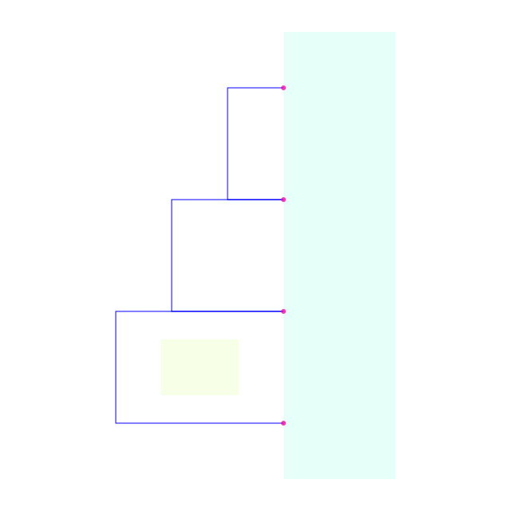
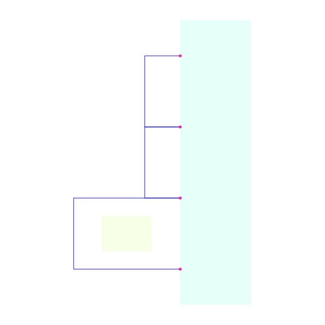

# Align clear rails beside an obstructed branch

Reproducer for the remaining partial-group case in [issue #34](https://github.com/tscircuit/schematic-trace-solver/issues/34).

Three same-net routes connect adjacent pins on one component side. Their rails sit at x = -2, -3 and -4. An obstacle prevents the bottom rail moving to -2 or -3; moving the whole group to -4 would make the drawing longer. Previously, rejecting the complete group also prevented the top two rails from aligning.

The fallback considers connected two-trace subsets after all complete groups are rejected. It keeps the existing component/side, corridor, obstacle, trace-clearance and label-anchor rules. It also checks the entire net's visible geometry, so losing overlap with a rail outside the subset cannot masquerade as an improvement.

| Original source | Patched source |
| --- | --- |
|  |  |

The blocker is the smaller pale rectangle; the large rectangle is the component. These are native `TraceCleanupSolver.visualize()` outputs from the executed example, rendered with `graphics-debug` on a white background.

## Reproduce

The explicit routed example and its transposed variant are defined in `tests/solvers/TraceCleanupSolver/same-net-rail-partial-groups.test.ts`. Run:

```sh
SCHEMATIC_PARTIAL_RAIL_ARTIFACT_DIR=tmp/partial-rail-alignment bun test tests/solvers/TraceCleanupSolver/same-net-rail-partial-groups.test.ts
```

With that optional environment variable, the same check writes before/after PNG, SVG and graphics JSON files for both orientations. No browser is needed.

## Observed result

Bun 1.3.14, Linux x64; baseline `353c17eab17f7823af3c35e6ae2e647cdc43d946` and the patch use the same installed dependencies.

| Measurement | Baseline | Patch |
| --- | ---: | ---: |
| Focused cases passing | 8 / 10 | 10 / 10 |
| Clear-pair alignment cases passing | 0 / 2 | 2 / 2 |
| Visible trace length, each orientation | 15 | 14 |
| Moved traces, each orientation | 0 | 1 |

The two baseline failures are the missing alignments. Controls cover excluded traces, immutable same-net wires, preservation of overlap with untouched same-net geometry, foreign-net clearance, endpoints, obstacles and input immutability. The bottom rail stays unchanged. This is one focused before/after check, not a full-suite, typecheck, build, or performance result. An initial dependency startup failure was repaired before any cases executed.
