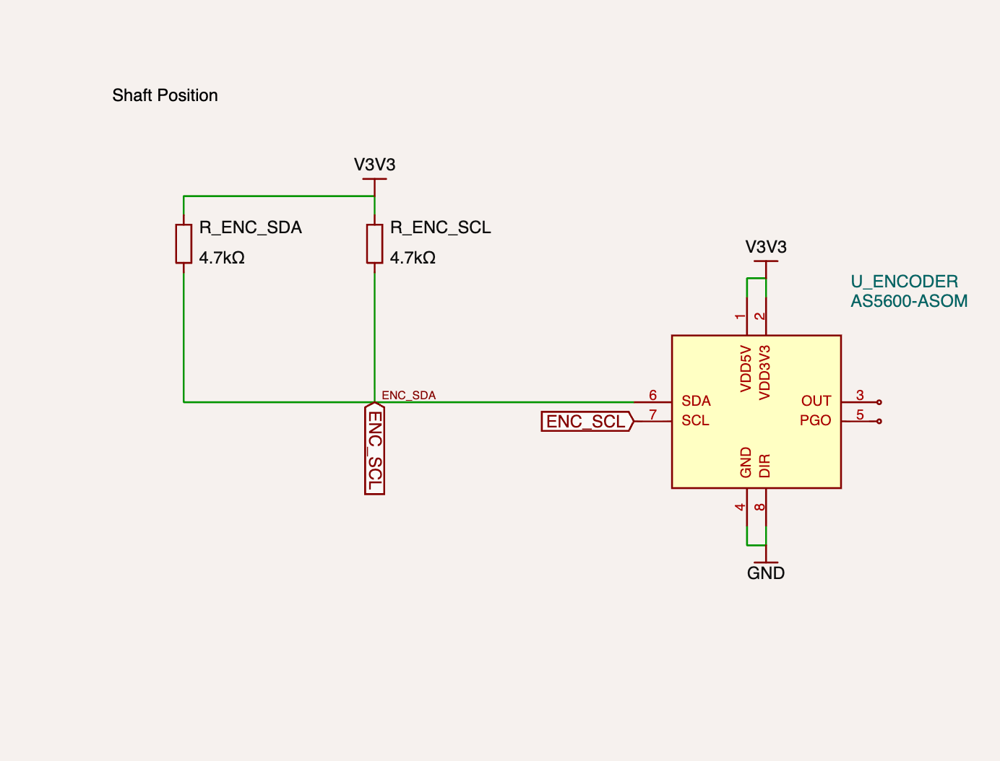
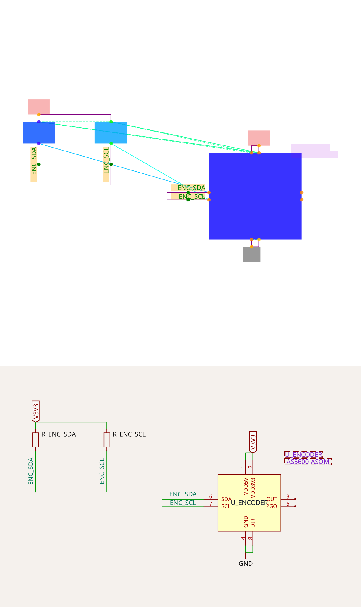

# RP2040 motor controller: shaft position

Reduced routing fixture for the **Shaft Position** section of
[imrishabh18/rp2040-motor-controller](https://tscircuit.com/imrishabh18/rp2040-motor-controller#files).
Includes the AS5600-ASOM encoder and its two 4.7 kΩ pull-ups. No solver implementation changes.

## Reported appearance

The supplied reference shows the ENC_SCL pull-up stub ending almost on the
horizontal ENC_SDA trace, making separate nets look joined:



The published `dist/schematic/circuit.json` confirms the geometry: the SDA
horizontal segment lies at y=0.5389999999999993, spanning x=-11 to -6.285.
The SCL stub at x=-9 ends at y=0.5399999999999991, only 0.001 away.
Their connectivity keys are distinct (`net67` and `net68`). This is a visual
near-contact, not evidence that the source nets are electrically shorted.

## Extraction and limits

Source release: `575c3059-0e95-4601-9a67-4db9ffb7d032`, version `1.0.19`,
retrieved 2026-09-16. Components and connections come from
`schematic/FeedbackSection.tsx`; exact component centers, sizes, symbol names,
all 12 pin positions and directions come from `dist/schematic/circuit.json`.
IDs are renamed to readable component/pin names. OUT and PGO stay unconnected.
VDD5V and VDD3V3 share V3V3; GND and DIR share GND.

This is **reconstructed solver input**, not a captured core debug invocation.
The MCU, alarm and bypass sections are omitted. Connections leaving the
section become named nets. The five internal point-to-point traces are retained.
The fixture uses the solver default `maxMspPairDistance: 2.4`, 0.42-wide rail
labels, 0.96-wide signal labels, and inline eligibility on the explicitly labeled
signal traces. Encoder text obstacles use the published text positions with
estimated widths of 0.12 per character and height 0.18. Resistor values remain
in this source description and reference; the generic solver symbol renderer
does not accept per-component resistance values.

On baseline `fac39fe` (solver 0.0.198), the reduced input falls back to separate
SDA/SCL endpoint labels instead of reproducing the original long SDA route and
near-touching SCL stub. The reference preserves the reported appearance, while
the runnable fixture/snapshot provides the section for further solver debugging.
The passing snapshot test records current behavior; it is not a claimed fix or
an assertion that the original visual defect has been reproduced by this input.

## Run

```sh
bun install
bun test tests/repros/repro-rp2040-shaft-position.test.ts
bun run debug:pipeline tests/repros/assets/repro-rp2040-shaft-position.input.json --svg
bunx tsc --noEmit
```

For interactive investigation, run `bun start` and open
`SchematicTracePipelineSolver/repro-rp2040-shaft-position` in Cosmos.


