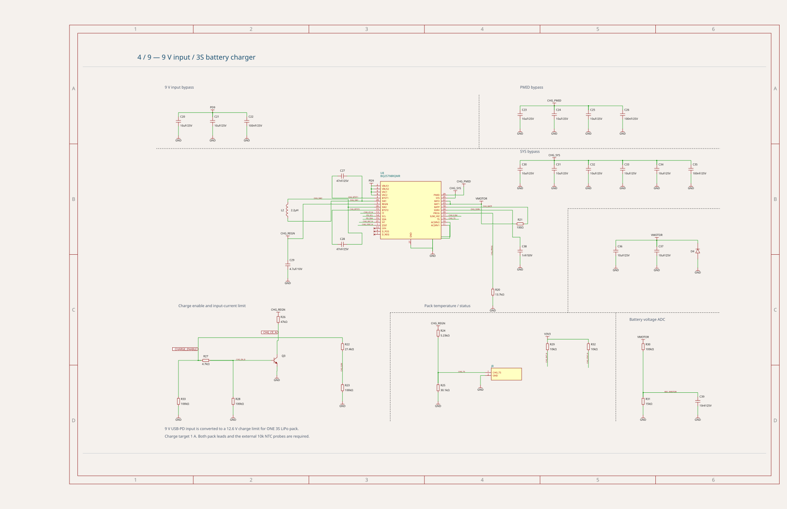

# RP2040 BLDC controller — v0.3.21 charger sheet

Reproduces the schematic trace solver input for the **charger** sheet of
[MustafaMulla29/rp2040-bldc-motor-controller-new, v0.3.21](https://mustafamulla29--rp2040-bldc-motor-controller-new-v0-3-21.tscircuit.app).
The reported sheet has sprawling local connections around the BQ25798 charger,
its bootstrap capacitors/inductor, and the charge-enable/input-limit network.
This fixture records the existing behavior for investigation; it does not fix
routing or assert that the reported schematic style issues have been resolved.

## Published sheet reference



`published-charger.svg` is a reference rendering of the original release, using
`circuit-to-svg@0.0.433` and `schematicSheetIndex: 3`. It is separate from the
current solver snapshot below `__snapshots__`. No circuit records were edited.

## Run

```sh
bun test tests/repros/rp2040-bldc-charger-v0.3.21/charger.test.ts
bun run debug:pipeline tests/repros/rp2040-bldc-charger-v0.3.21/charger.input.json
```

The test uses the standard solver snapshot matcher, with solver debug graphics
above the semantic schematic. For interactive stage stepping, run `bun run start`
and open `bug-reports/rp2040-bldc-charger-v0.3.21`.

## Provenance

- Published release ID: `bdff7fc1-f5b9-4266-8bb2-4014de872446`.
- Source package version: `0.3.21` (not the current board project).
- Downloaded source: `index.circuit.tsx`, its circuit/import dependencies, and the
  published schematic placement and power-label JSON files from that release.
- Extraction versions match its `bun.lock`: `tscircuit@0.0.2687`,
  `@tscircuit/core@0.0.2021`, `@tscircuit/schematic-trace-solver@0.0.212`,
  and `schematic-symbols@0.0.248`.
- Captured the unmodified `solverParams` from the `solver:started` event for
  `SchematicTracePipelineSolver`, selecting the input containing U8
  (`schematic_component_34`). The original full board was rendered with PCB and
  the parts engine disabled; no PCB autorouting was run.
- Retains all **39 components, 106 pins and 24 nets**, their original section IDs,
  text obstacles, inline-label settings, and `maxMspPairDistance: 12`.
- Component placement/symbol geometry, all 106 schematic port records (excluding
  the post-routing `is_connected` flag), and all 106 pin-to-net assignments were
  compared against the published `dist/index/circuit.json`: no differences.
- Published Circuit JSON SHA-256:
  `c0212db6f7a4001d1125f03b543a9e5780fa283e5fa65a311014bd4cdbd6f4cd`.

The snapshot runs this historical input through the repository's current solver.
It is not a pixel-for-pixel rendering of the website: sheet borders, explanatory
notes, and core-rendered symbol/net-label details are outside the solver input.
The website's style-warning count is produced by a separate analysis and is not
an assertion of this reproduction test.

[Published Circuit JSON](https://api.tscircuit.com/package_files/view?package_release_id=bdff7fc1-f5b9-4266-8bb2-4014de872446&file_path=dist%2Findex%2Fcircuit.json)

## Related sheets from the same release

- [programming](../rp2040-bldc-programming-v0.3.21/README.md)
- [motor_control](../rp2040-bldc-motor-control-v0.3.21/README.md)
- [battery](../rp2040-bldc-battery-v0.3.21/README.md)
