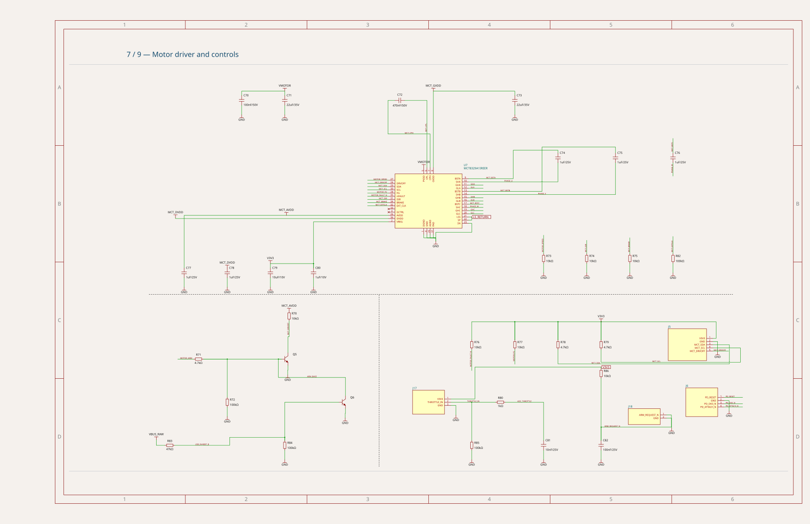

# RP2040 BLDC controller — v0.3.21 motor_control sheet

Reproduces the **motor_control** sheet of
[MustafaMulla29/rp2040-bldc-motor-controller-new, v0.3.21](https://mustafamulla29--rp2040-bldc-motor-controller-new-v0-3-21.tscircuit.app).
This covers the MCT8329A gate-driver supply/bootstrap wiring and the throttle/arming circuits.
The fixture captures the reported layout for investigation; it does not fix the
solver or claim that schematic style issues have been resolved.

## Published sheet reference



The reference SVG was rendered from the original published Circuit JSON using
`circuit-to-svg@0.0.433` and `schematicSheetIndex: 6`. No circuit records
were edited. The separate snapshot under `__snapshots__` shows the repository's
current solver output for the captured historical input.

## Run

```sh
bun test tests/repros/rp2040-bldc-motor-control-v0.3.21/motor-control.test.ts
bun run debug:pipeline tests/repros/rp2040-bldc-motor-control-v0.3.21/motor-control.input.json
```

For interactive stage stepping, run `bun run start` and open
`bug-reports/rp2040-bldc-motor-control-v0.3.21`.

## Provenance and scope

This is the same release and extraction workflow as the
[charger reproduction](../rp2040-bldc-charger-v0.3.21/README.md#provenance): release
`bdff7fc1-f5b9-4266-8bb2-4014de872446`, with the release's locked core/solver versions.
The unmodified `solverParams` were captured from `solver:started`, selecting the
input whose component IDs exactly match the published **motor_control** sheet.

- **36 components, 115 pins, 40 nets and 1 direct connection**.
- Retains section IDs, text obstacles, inline-label settings, original IDs and
  `maxMspPairDistance: 12`.
- Component placement/symbol geometry, all 115 schematic port records
  (excluding post-routing `is_connected`), and all 115 pin-to-net assignments
  match the published artifact exactly.
- No PCB routing or changes to the current board project were involved.

The historical solver input omits some symbol/display metadata present in the
published Circuit JSON. Sheet borders, notes and core-rendered details also sit
outside this input. Consequently, the solver snapshot is not a pixel-for-pixel
website rendering; use the reference SVG above for the original appearance.
The website's analysis warning count is not an assertion of this test.
